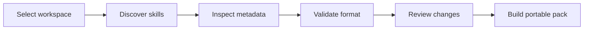

# SkillDeck

**A visual workspace for organizing reusable AI coding skills and instruction packs.**

> [!NOTE]
> SkillDeck is in the foundation phase. This repository currently defines product scope, data structures, and release gates. No production-ready application is claimed.

## About

SkillDeck is planned as a local desktop manager for reusable AI coding skills and instruction packs. It will help users browse supported skill folders, understand their metadata, compare revisions, validate common formatting problems, and build portable collections for supported tools.

The product will treat skill files as source-controlled configuration. Changes should be previewable, traceable, and reversible.

## Planned workflow

## Planned capabilities

- Discover compatible local skill and instruction folders.
- Display name, description, source, version, supported tools, and validation state.
- Import from a local folder or a user-selected repository.
- Preview revisions with a readable diff.
- Detect duplicate names, missing metadata, and overlapping instructions.
- Edit Markdown-based skill files with validation.
- Export portable skill packs with checksums and a manifest.
- Create local restoration points before applying changes.
- Support adapters for several documented AI coding-tool formats.

## Interface direction

| View | Purpose |
|---|---|
| Library | Browse installed, local, and imported skills. |
| Inspector | Review metadata, files, compatibility, and findings. |
| Diff preview | Compare the current and proposed version. |
| Validation center | Review naming, metadata, and compatibility findings. |
| Pack builder | Select skills and export a portable manifest. |
| Activity log | Review user-initiated changes and restoration points. |

## Design principles

- Keep local files local by default.
- Show exact changes before applying them.
- Preserve source attribution and applicable notices.
- Keep validation findings separate from user decisions.
- Record adapter transformations in exported manifests.
- Avoid claiming compatibility until a format has fixtures and tests.

## Status

| Workstream | State |
|---|---|
| Product model | Active |
| Skill manifest schema | Planned |
| Discovery adapters | Planned |
| Validation engine | Planned |
| Desktop application | Planned |
| Pack export and restore | Planned |

Read [ABOUT.md](ABOUT.md) for positioning and [ROADMAP.md](ROADMAP.md) for staged delivery.

## Contributing

Early contributions should focus on manifest design, adapter documentation, validation examples, accessibility, and test fixtures. Proposals should include the affected format and example input/output files.

## Project relationship

SkillDeck is an independent companion project. It is not an official product of any supported AI coding tool. Third-party names are used only to describe planned compatibility.

## License

The project license will be finalized before executable source is published. Imported skill packs remain subject to their own licenses.